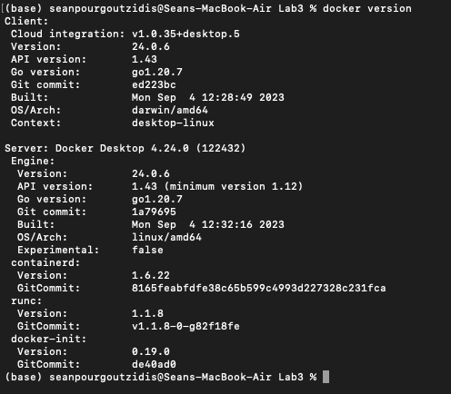
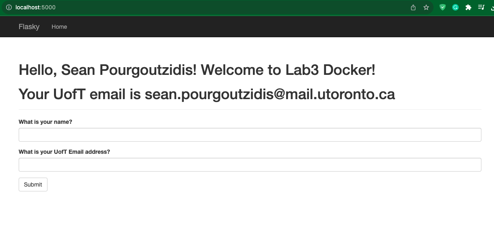
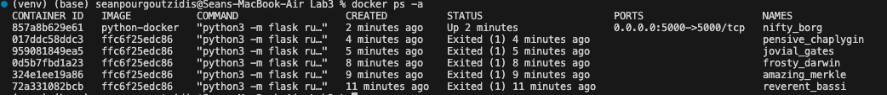
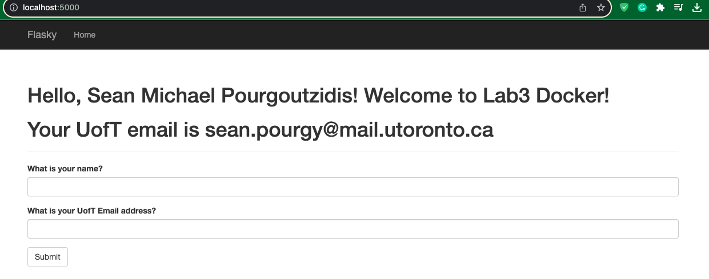

# Sean Pourgoutzidis - Lab3

This repo is a clone of https://github.com/miguelgrinberg/flasky for learning purposes. It is also being used to learn Docker!

# Activity 2

# Activity 3

# Activity 4

